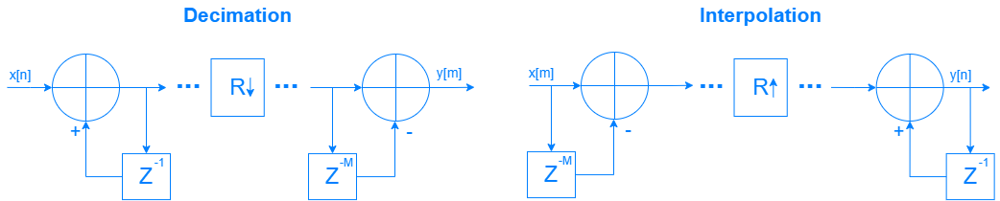
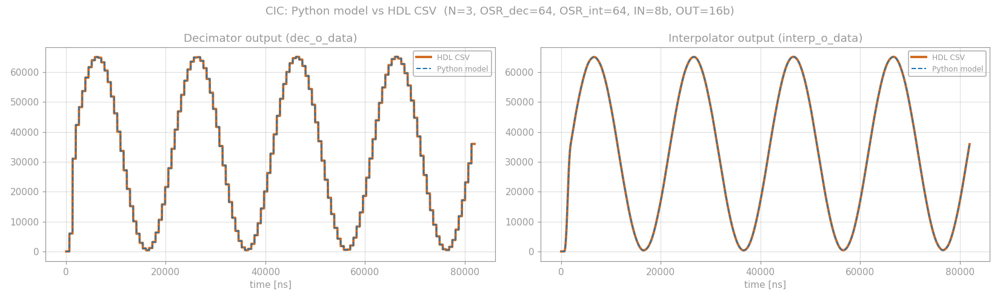

# CIC Filter — Configurable Decimator / Interpolator

A parametrable **CIC (Cascaded Integrator–Comb)** filter, provided in **two equivalent
RTL implementations** (Verilog-2001 and VHDL-2008), with a parametrable testbench for
each language and a **bit-exact Python model** used to verify the HDL output.

The same module implements either a **decimator** or an **interpolator**, selected by a
single generic/parameter (`CONFIG`).

---

## Table of contents

- [Getting the repository](#getting-the-repository)
- [Overview](#overview)
- [Theory background](#theory-background)
  - [From the delay sum to the integrator–comb form](#from-the-delay-sum-to-the-integratorcomb-form)
  - [Where the rate change goes: decimator vs interpolator](#where-the-rate-change-goes-decimator-vs-interpolator)
  - [Frequency response](#frequency-response)
  - [Register sizing](#register-sizing)
  - [Why modulo arithmetic works](#why-modulo-arithmetic-works)
  - [Output truncation](#output-truncation)
- [Interface](#interface)
  - [Parameters / generics](#parameters--generics)
  - [Ports](#ports)
  - [Handshake and timing](#handshake-and-timing)
- [Simulation](#simulation)
- [Repository layout](#repository-layout)
- [References](#references)

---

## Getting the repository

```bash
git clone https://github.com/Anelay02/CIC-implementation-Verilog-VHDL-.git
```

The Python model additionally needs :

```bash
pip install matplotlib math sys os
```

---

## Overview

| Item | Description |
|---|---|
| `rtl/CIC.v` | Verilog-2001 implementation |
| `rtl/CIC.vhd` | VHDL-2008 implementation (functionally identical) |
| `tb/tb_CIC.v` / `tb/tb_CIC.vhd` | Parametrable testbenches — instantiate **one decimator and one interpolator** side by side, drive them with a sine, and log everything to a CSV |
| `python/cic_model.py` | Bit-exact Python model of the RTL **and** of the testbench; reads the CSV produced by the simulator, re-runs the same scenario in Python, compares sample by sample and plots the result |

Key characteristics of the design:

- Order `N`, rate-change ratio `OSR` and data widths are all parameters.
- Differential delay is fixed to **M = 1**.
- Unsigned data path, single-width registers, **no saturation and no rounding** —
  correctness relies on modulo (wrap-around) arithmetic, as in Hogenauer's original paper.
- One adder/subtractor and one register per stage: no multipliers, no coefficient storage.
- Fully synchronous, single clock domain, asynchronous active-low reset.
  The rate change is handled with clock **enables**, not with a second clock.

---

## Theory background

### From the delay sum to the integrator–comb form

The elementary block of a CIC is a plain **boxcar (moving-average) filter** of length
`R = OSR`, whose impulse response is `R` consecutive ones:

$$
y[n] \= \sum_{k=0}^{R-1} x[n-k]
\qquad\Longrightarrow\qquad
H(z) \= \sum_{k=0}^{R-1} z^{-k}
$$

That sum is a **geometric series** of common ratio $z^{-1}$, so it has a closed form:

$$
\sum_{k=0}^{R-1} z^{-k} \= \frac{1-z^{-R}}{1-z^{-1}}
$$

This single identity is the whole idea behind the CIC. It splits a filter that would
naively need `R-1` additions per sample into two trivial pieces:

$$
H(z) \= \underbrace{\left(1-z^{-R}\right)}_{\text{comb}}\cdot
       \underbrace{\frac{1}{1-z^{-1}}}_{\text{integrator}}
$$

- the **integrator** $1/(1-z^{-1})$ is a one-tap accumulator: `y[n] = y[n-1] + x[n]`;
- the **comb** $1-z^{-R}$ is a one-tap differentiator: `y[n] = x[n] - x[n-R]`.

Neither depends on `R` in terms of hardware cost (only the comb's delay line does), and
neither contains a multiplier — the filter's coefficients are all `1`.

Cascading `N` such sections gives the `N`-th order CIC:

$$
H(z) \= \left(\frac{1-z^{-R}}{1-z^{-1}}\right)^{\!N}
     \= \left(1-z^{-R}\right)^{N}\cdot\frac{1}{\left(1-z^{-1}\right)^{N}}
$$

Because every section is LTI, the factors commute: all `N` integrators can be grouped on
one side and all `N` combs on the other. That regrouping is what makes the rate change
free.

### Where the rate change goes: decimator vs interpolator

<!-- TODO: schematic still missing, will be added later -->


Applying the **Noble identities** to move the resampler through the comb section:

- **Decimator** — integrators run at the **high** rate, then decimate by `R`, then the
  combs run at the **low** rate. Downsampling by `R` turns the high-rate comb
  $1-z^{-R}$ into a low-rate comb $1-z^{-1}$, so the `R`-deep delay line collapses into
  a **single register**.

  ```
  x[n] ──► ∫ ──► ∫ ─ ⋯ ─► ∫ ──► ↓R ──► comb ──► comb ─ ⋯ ─► comb ──► y[m]
           └──── N, at f_s ────┘         └──── N, at f_s/R ────┘
  ```

- **Interpolator** — the mirror image. The combs run first at the **low** rate, the
  signal is **zero-stuffed** by `R`, and the integrators run at the **high** rate.

  ```
  x[m] ──► comb ─ ⋯ ─► comb ──► ↑R ──► ∫ ─ ⋯ ─► ∫ ──► y[n]
           └── N, at f_s/R ──┘         └── N, at f_s ──┘
  ```

The RTL implements exactly this. `CONFIG` selects which of the two `generate` branches is
elaborated, and the ordering of the two sections (and which one is registered on the slow
enable) is the only structural difference between them:

| | Decimator | Interpolator |
|---|---|---|
| First section | Integrators | Combs |
| Second section | Combs | Integrators |
| Clocked on `i_valid` (high rate) | Integrators | Integrators |
| Clocked on `accept_sample` (low rate) | Combs | Combs |
| Output taken from | last comb | last integrator |
| Output valid | one cycle per `OSR` inputs | every cycle |

`accept_sample` is the low-rate enable. It is generated by a free-running `LOG_OSR`-bit
counter that increments on every valid input and is decoded on its all-ones state — which
is why **`OSR` must be a power of two**.

### Frequency response

Evaluating on the unit circle, with `f` normalised to the high rate `f_s`:

$$
\left|H(f)\right| \= \left|\frac{\sin(\pi R f)}{\sin(\pi f)}\right|^{N}
$$

This is a `sinc`-like response with **nulls at $f = k/R$**, $k = 1 \dots R-1$. Those nulls
sit exactly at the centres of the bands that fold onto the passband when decimating by `R`
(or that appear as images when interpolating), which is why a CIC is an effective
anti-aliasing / anti-imaging filter despite having no coefficients at all.

The price is passband droop: the response is already sagging well before the first null,
and the droop worsens with `N`. In a real system the CIC is usually followed (decimation)
or preceded (interpolation) by a short compensation FIR running at the low rate.

The DC gain is $G = R^{N}$ for the decimator. For the interpolator, zero-stuffing inserts
`R-1` zeros for each input sample, which divides the average by `R`, so the effective gain
is $G = R^{N-1}$. This difference is what drives the register sizing below.

### Register sizing

The registers must be wide enough that the **largest value reachable anywhere in the
cascade** still fits. With unsigned input of `INPUT_SIZE` bits, maximum input code
$2^{B_{in}}-1$, and differential delay `M = 1`:

**Decimator** — worst-case gain $R^{N}$:

$$
B_{reg} \= N\log_2(R) + B_{in}
$$

**Interpolator** — worst-case gain $R^{N-1}$:

$$
B_{reg} \= (N-1)\log_2(R) + B_{in}
$$

Which is precisely the `REG_SIZE` localparam / constant in the RTL:

```verilog
localparam LOG_OSR  = $clog2(OSR);
localparam REG_SIZE = (CONFIG == "interpolator") ? (N-1)*LOG_OSR + INPUT_SIZE
                                                 :  N   *LOG_OSR + INPUT_SIZE;
```

Note that **every** register in the design — every integrator and every comb, in both
sections — is `REG_SIZE` bits wide. Hogenauer's per-stage pruning (giving each stage only
as many bits as it actually needs) is *not* implemented here; the design trades a little
area for simplicity and for the modulo argument below, which requires uniform width.

Worked example, for the defaults used by the testbench (`N = 3`, `OSR = 64`,
`INPUT_SIZE = 8`, so `LOG_OSR = 6`):

| Config | `REG_SIZE` | Gain |
|---|---|---|
| Decimator | `3·6 + 8 = 26` bits | `64³ = 2¹⁸` |
| Interpolator | `2·6 + 8 = 20` bits | `64² = 2¹²` |

### Why modulo arithmetic works

An integrator has a pole *on* the unit circle at `z = 1`: its DC gain is infinite, so its
register **will** overflow and wrap around, and it will keep wrapping forever. This looks
fatal, and it is the part of a CIC that surprises people the first time.

It is harmless, for a precise reason. All the arithmetic here is unsigned two's-complement
arithmetic modulo $2^{B_{reg}}$, i.e. it lives in the ring $\mathbb{Z}/2^{B_{reg}}\mathbb{Z}$.
Addition and subtraction in that ring are well defined and associative, and the whole
integrator–comb cascade is built out of nothing but additions, subtractions and delays.
So the cascade is a **linear system over that ring**, and the algebraic identity

$$
\left(1-z^{-R}\right)^{N}\cdot\frac{1}{\left(1-z^{-1}\right)^{N}} \= \left(\sum_{k=0}^{R-1} z^{-k}\right)^{\!N}
$$

holds modulo $2^{B_{reg}}$ just as it holds over the integers. The combs subtract the
wrapped values from each other, and the wrapping cancels exactly.

Two conditions must be met for this to be true, and both are satisfied by construction:

1. **Uniform width.** Every register in the cascade is exactly `REG_SIZE` bits, so every
   intermediate value is reduced modulo the *same* $2^{B_{reg}}$. Mixing widths would
   break the cancellation.
2. **The true result fits.** The final, mathematically correct output must itself be
   representable in `REG_SIZE` bits — which is exactly what the sizing formulas above
   guarantee. A value that is correct modulo $2^{B_{reg}}$ *and* known to lie in
   $[0, 2^{B_{reg}})$ is correct, full stop.

The practical consequence: **no saturation logic, no overflow flags and no wider
accumulators are needed.** The intermediate integrator outputs are meaningless on their
own if you probe them in a waveform viewer, but the output of the last comb is exact.

### Output truncation

The last stage is `REG_SIZE` bits, the output port is `OUTPUT_SIZE` bits. The RTL keeps
the **MSBs** and drops the `LSB_OUT` lowest bits:

```verilog
localparam LSB_OUT = (REG_SIZE > OUTPUT_SIZE) ? REG_SIZE - OUTPUT_SIZE : 0;
...
o_data <= final_stage[N*REG_SIZE-1 : LSB_OUT + (N-1)*REG_SIZE];
```

This is a plain truncation (round-toward-zero), not rounding — it costs no hardware and
adds a small DC offset plus a truncation noise floor. Dropping `LSB_OUT` bits also divides
the filter's large intrinsic gain by $2^{LSB\_OUT}$, which is normally what you want, since
the raw gain $R^{N}$ is not a quantity you want at the output.

If `OUTPUT_SIZE ≥ REG_SIZE`, `LSB_OUT` is `0` and the result is simply zero-extended: no
information is lost, and the full gain appears at the output.

---

## Interface

Both implementations expose an identical interface.

### Parameters / generics

| Name | Type | Default | Description |
|---|---|---|---|
| `N` | integer | `3` | **Order** of the filter: number of integrator stages *and* number of comb stages. Sets the steepness of the response and the depth of the nulls; also sets the passband droop and the register growth. `N ≥ 1`. |
| `OSR` | integer | `512` | **Rate-change ratio** `R`. Decimation factor in decimator mode, interpolation factor in interpolator mode. **Must be a power of two** — the low-rate enable is produced by all-ones decoding of a `$clog2(OSR)`-bit counter, which is only periodic-by-`OSR` for powers of two. `OSR ≥ 2`. |
| `INPUT_SIZE` | integer | `1` | Width of `i_data`, in bits. Data is treated as **unsigned**. The default of `1` targets the classic use case of filtering a 1-bit sigma-delta bitstream. |
| `OUTPUT_SIZE` | integer | `16` | Width of `o_data`, in bits, **unsigned**. If smaller than `REG_SIZE` the result is truncated from the LSB side (see above); if larger, it is zero-extended. |
| `CONFIG` | string | `"decimator"` | Selects the topology: `"interpolator"` selects the interpolator branch, **any other value** selects the decimator branch. |

`REG_SIZE`, `LOG_OSR` and `LSB_OUT` are derived internally and are not meant to be
overridden.

### Ports

| Name | Dir | Width | Description |
|---|---|---|---|
| `i_clk` | in | 1 | Clock. Everything is on the **rising edge**. This is the **high-rate** clock in both modes; the low rate is derived with an enable, so there is a single clock domain. |
| `i_rst_n` | in | 1 | **Asynchronous, active-low** reset. Clears every integrator, every comb, the sample counter and the output registers. |
| `i_data` | in | `INPUT_SIZE` | Unsigned input sample. |
| `i_valid` | in | 1 | Input sample enable. **The whole filter only advances when `i_valid` is high** — the sample counter, the integrators and (via `accept_sample`) the combs are all gated by it. Holding it low freezes the filter without disturbing its state, so it doubles as a clock-enable. |
| `o_data` | out | `OUTPUT_SIZE` | Unsigned output sample, **registered**. Holds its previous value between updates. |
| `o_valid` | out | 1 | **Registered** flag, high for the one cycle during which `o_data` is new. |
| `o_ready` | out | 1 | Input-side flow control, **combinational**. See below. |

### Handshake and timing

The two modes use the ports differently, because the rate change sits on opposite sides:

**Decimator** — the input is the fast side, the output is the slow side.

- Present one new sample per cycle with `i_valid` high.
- `o_ready` is simply `i_rst_n`: the decimator accepts a sample on every cycle it is not
  in reset, so it never applies back-pressure.
- `o_valid` pulses high for **one cycle every `OSR` valid input samples**, one clock after
  the `OSR`-th sample is accepted (the output register adds that single cycle of latency).

**Interpolator** — the input is the slow side, the output is the fast side.

- `i_valid` is used as the **high-rate enable**: keep it high to make the interpolator run.
- `o_ready` marks the cycle on which a **new low-rate input sample is actually latched**,
  i.e. one cycle out of every `OSR`. `i_data` is sampled on that cycle and ignored on all
  the others, so the upstream block should update `i_data` after it has seen `o_ready`
  high. It is a "sample taken now" strobe rather than a permission flag asserted in
  advance.
- `o_valid` follows `i_valid` (delayed one cycle): the interpolator produces **one output
  per clock**, which is the point of the zero-stuffing.

In both modes the output is registered, so `o_data`/`o_valid` appear **one clock cycle
after** the internal update they correspond to. There is no pipeline beyond that; the
combinational path through the `N` chained adders is the critical path and grows with `N`.

---

## Simulation

Both testbenches instantiate **one decimator and one interpolator at the same time**,
sharing a clock and a reset, drive both with a full-scale sine, and log the stimulus and
both outputs to `tb_CIC.csv` on every clock edge after reset.

Verified with **VHDL-2008** and **Verilog-2001** in **Questa-Lattice 2025.2**.

Testbench parameters (identical in both languages, edit them at the top of the file):

| Parameter | Default | Description |
|---|---|---|
| `CSV_ENABLE` | `1` / `true` | Enable CSV logging |
| `CSV_FILE` | `"tb_CIC.csv"` | Output CSV name |
| `N` | `3` | Order used for **both** DUTs |
| `OSR_DEC` | `64` | Decimator OSR (power of two) |
| `OSR_INT` | `64` | Interpolator OSR (power of two) |
| `INPUT_SIZE` | `8` | Input width for both DUTs |
| `OUTPUT_SIZE` | `16` | Output width for both DUTs |
| `CLK_PERIOD_NS` | `10.0` | Clock period, ns (100 MHz) |
| `F_SIGNAL_HZ` | `50_000.0` | Sine frequency — must stay well below `f_clk / (2·OSR)` |
| `NB_PERIODS` | `4` | Number of sine periods to simulate |

The stimulus differs per DUT, to match the side each one has its slow rate on: the
decimator gets a new sine sample **every clock cycle**, while the interpolator gets a new
one **every `OSR_INT` cycles**. Both are rounded half-up and saturated to the input range.
After the requested number of periods, `4·max(OSR_DEC, OSR_INT)` extra cycles are run to
flush both pipelines.

### Running it

Compile the RTL and the testbench of the language you want, then run. For example, with
Questa:

```bash
# Verilog
vlog rtl/CIC.v tb/tb_CIC.v
vsim -c tb_CIC -do "run -all; quit"

# VHDL-2008
vcom -2008 rtl/CIC.vhd tb/tb_CIC.vhd
vsim -c tb_CIC -do "run -all; quit"
```

The run produces `tb_CIC.csv` and `tb_CIC.vcd` in the simulation directory. Move (or point)
them to `results/`, where a reference pair from a previous run is already committed.

### Checking against the Python model

`python/cic_model.py` is a **bit-exact model of both the RTL and the testbench**: it
reimplements the register-transfer behaviour stage by stage (including the modulo
wrap-around, the truncation and the exact reset/valid timing) and reproduces the same sine
stimulus with the same rounding. It writes no CSV of its own — it reads the one the
simulator produced, regenerates the equivalent data in memory and compares them row by row.

Its parameters are set directly in the file and **must be kept in sync with the
testbench's**. Paths are relative, so run it from inside `python/`:

```bash
cd python
python cic_model.py
```

Output:

```
N=3 OSR_DEC=64 OSR_INT=64 INPUT_SIZE=8 OUTPUT_SIZE=16
samples_per_period=31  run_cycles=8192
--- Comparison ../results/tb_CIC.csv vs python model ---
  rows: reference=8192  python=8192
  RESULT: BIT-EXACT MATCH
```

The script exits with status `0` on a bit-exact match and `1` otherwise (and prints the
first few mismatching rows with the offending column names), so it can be dropped into CI
as-is. It also saves an overlay of the two output streams to `Img/cic_compare.pdf`:



The plot is deliberately saved with a transparent background and opaque, high-contrast
traces so that it stays readable in both light and dark viewing modes.

---

## Repository layout

```
.
├── Img/
│   ├── schematic.pdf        # CIC structure, decimator and interpolator
│   └── cic_compare.pdf      # Python model vs HDL simulation
├── python/
│   └── cic_model.py         # bit-exact model + CSV comparison + plot
├── results/
│   ├── tb_CIC.csv           # reference simulation log
│   └── tb_CIC.vcd           # reference waveform dump
├── rtl/
│   ├── CIC.v                # Verilog-2001 implementation
│   └── CIC.vhd              # VHDL-2008 implementation
└── tb/
    ├── tb_CIC.v             # Verilog testbench
    └── tb_CIC.vhd           # VHDL testbench
```

---

## References

E. Hogenauer, *An economical class of digital filters for decimation and interpolation*,
IEEE Transactions on Acoustics, Speech, and Signal Processing, vol. 29, no. 2,
pp. 155–162, 1981. [doi:10.1109/TASSP.1981.1163535](https://doi.org/10.1109/TASSP.1981.1163535)

R. Lyons, *A Beginner's Guide To Cascaded Integrator-Comb (CIC) Filters*, dsprelated.com —
<https://www.dsprelated.com/showarticle/1337.php>
